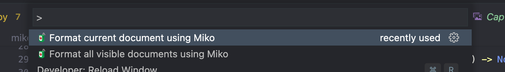
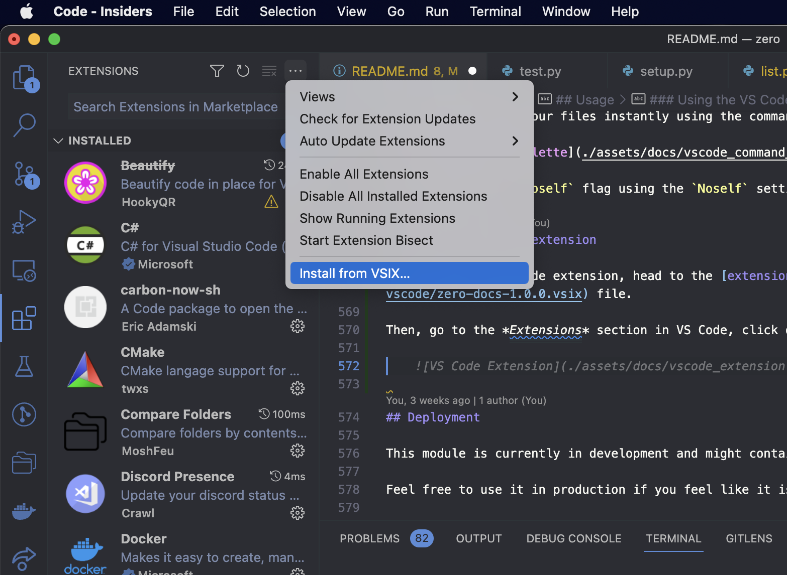

# `miko` (originally: `zero`)


 A new Python documentation style

***See how to use a Python object at a glance!***

<br>
<br>

[](https://pypi.org/project/miko/)
[](https://pepy.tech/project/miko)
[](https://pypistats.org/packages/miko)
[](https://pypi.org/project/miko/)
[](https://pypi.org/project/miko/)
[](https://github.com/Animenosekai/miko/blob/master/LICENSE)
[](https://github.com/Animenosekai/miko)
[](https://github.com/Animenosekai/miko/actions?query=workflow%3ACodeQL)
[](https://github.com/Animenosekai/miko/actions/workflows/pytest.yml)


## Getting Started

These instructions will get you a copy of the project up and running on your local machine for development and testing purposes. See deployment for notes on how to deploy the project on a live system.

### Prerequisites

#### Python

You will need Python 3 to use this module

```bash
# vermin output
Minimum required versions: 3.4
Incompatible versions:     2
```

## Installing

### Option 1: From PyPI

```bash
pip install --upgrade miko
```

### Option 2: From Git

```bash
pip install --upgrade git+https://github.com/Animenosekai/miko
```

You can check if you successfully installed it by printing out its version:

```bash
$ python -c "import miko; print(miko.__version__)"
# output:
miko v1.0
```

```bash
$ miko --version
# output:
miko v1.0
```

## Purpose

This new style aims at bringing an ease of use for both humans and computers.

It also helps me get concise while writing docstrings as I tend to use different styles even within a same file.

## Style

Miko defines a new way of documenting your source code.

You will here learn the different sections of your documentation string.

### Outline

The *Miko* way of documenting stuff is by using Markdown in your documentation and following the rules below.

#### Start

When you want to document the object, you need to start the docstring with 3 quotation marks, preferably double quotation marks.

You also need to add a line break and pad the whole documentation to line up with the start of the object name.

> Example: we are using 3 double quotation marks, and we start where the object name starts after a line break.

```python
def func():
    """
    It needs to start here

    Here we continue the documentation string
^^^^
(do not use this space)
    """
    pass
```

#### End

The documentation string ends when 3 quotation marks (the same as the beginning ones) are added after the padding.

### Description

After starting the documentation string, you can add a description for your object as a normal string.

There is not much styling or rules to follow since all the content outside any section is considered part of the description.

> Example: We are giving a description of the function at the start, but also at the end.

```python
def func():
    """
    Hello, this is a description.

    Returns
    ----------
    bool
        The result of the function.

    But this is also part of the description.
    """
```

### Parameters

You can define what are the different parameters/arguments the callable object is taking.

To start explaining the different parameters, you need to use the `Parameters` section name, followed by a line-break and at least 3 hyphens.

A single parameter element is defined by a name, followed by some options. And, on a new line, with a left padding, its description.

> Example

```python
def func(a, b: int, c = ""):
    """
    Parameters
    ----------
    a: bool
        this is the first argument
    b: int | float, default = 1.2
        this is the second argument
    c: str, optional
        this is the third argument
        it can have multiple lines
    """
```

> Aliases: `Parameters`, `Parameter`, `Params`, `Parm`, `Arguments`, `Argument`, `Args`, `Arg`

#### The options

You can specify options for each parameter.

The options are separated from the parameter name using a colon and a space.

Each option is separated by a comma.

- `<type>` : defines the type of the parameter.
- `optional` : defines a parameter as being optional, without needing to specify its default value. *(useful with keyword arguments for instance)*
- `default` : defines a parameter as being optional, by giving it a default value.
- `deprecated` : when a parameter is deprecated.

##### Types

Types can be defined by giving the element class name or *dot notation* path.

> Example: `str`, `translatepy.language.Language`

You can specify multiple types using the vertical bar separator.

> Example: `int | float`

##### Default

You can define a default value using an equal sign.

> Example: `default = 1`, `default=True`

### Returned Value

You can define what are the values returned by a callable object using the `Returns` section.

Each returning element is explained with the following rules: the type of the value and a description with a left-padding on a new line.

> Example

```python
def func():
    """
    Returns
    -------
    int
        the number returned
    str
        if it is a string returned
    list[int, str]
        if it's a list of both
    translatepy.Language
        using dot notation
    """
```

> Aliases: `Returns`, `Return`, `Returning`

### Example

You can give examples of your code, writing them as you would in a Python REPL.

```python
def func(a = False):
    """
    Example
    -------
    >>> func()
    "It is false"
    >>> func(True)
    "It is true"
    # when using something other than a boolean
    >>> func(1)
    2
    """
```

You can use `# comments` to explain your example.

> Aliases: `Examples`, `Example`

### Exceptions

You can inform the users about any exception/error your callable might be raising using the `Raising` section.

Like the `Returns` section, you need to give the name of the exception and then a description of why it would raise this exception and the special attribute the exception might have on a new line, left-padded.

> Example

```python
def func():
    """
    Raises
    ------
    ValueError
        If there is an error with the value
    """
```

> Aliases: `Raises`, `Raise`, `Raising`, `Exceptions`, `Exception`, `Errors`, `Error`

### Warnings

You can give warnings to the user using the `Warning` tag.

You just need to put `Warning`, followed by a colon, a space and the warning itself.

> Example

```python
def func():
    """
    Warning: This is a serious warning

    ...description...

    Warning: Another warning
    """
```

> Aliases: `Warnings`, `Warning`

<br>

> **Note**  
> Warnings are part of the description

### Notes

If you only want to notify the user about something, you can use the `Note` tag.

You just need to put `Note`, followed by a colon, a space and the note itself.

> Example

```python
def func():
    """
    Note: Yup, that's true

    ...description...

    Note: Another note
    """
```

> Aliases: `Notes`, `Note`, `See Also`, `Information`

<br>

> **Note**  
> Notes are part of the description

### Change log

You can inform the users about how the object got modified over time using the `Changelog` section.

Like the `Returns` section, you need to give the name of the version it got changed on and then a description of how it changed on a new line, left-padded.

> Example

```python
def func():
    """
    Changelog
    ---------
    1.4
        New default string
    0.6
        Raises ImportError instead of RuntimeError
    """
```

> Aliases: `Changelog`, `Changes`

### Deprecation Notice

To add a deprecation notice to your object, you can add `! DEPRECATED !` at the beginning of the docstring.

It must be the first thing (aside from whitespace) of the docstring.

> Example: At the very beginning of the docstring

```python
def func():
    """! DEPRECATED !
    This is a cool function.

    Changelog
    ---------
    1.5
        Added a deprecation notice, with the intention of the function being removed on the next major version.
    """
```

> Example: With a slight variation

```python
def func():
    """
    !DEPRECATED!

    This is a cool function.
    """
```
> Aliases: `Deprecated`, `Deprecation`, `Deprecate`, `Deprecation Notice`

### Copyright

You can add copyright/authors of the code using the `Copyright` section.

Like the `Returns` section, you need to give the name of the author and then a description of what they did on a new line, left-padded. The description could include stuff like the year they worked on the code, what they did, etc.

> Example

```python
def func():
    """
    Copyright
    ---------
    Animenosekai
        The initial author
    Some other dev
        A very cool collaborator
    """
```

> Aliases: `Copyrights`, `Copyright`, `Authors`, `Author`

## Usage

*Here, there will be the Python API Reference.*

### On Python

Two objects are exposed through the Python API

#### The `Docs` object

You can use the `Docs` object by passing a docstring and an optional function signature.

> Example

```python
from miko import Docs

parsed = Docs(
    """
    Hello

    Note: this is a test

    Changelog
    ---------
    1.0
        Adding this docstring
    """
)
```

##### Parameters

| Name | Description | Type | Default |
|------|-------------|------|---------|
| `docs` | This is the docstring to parse | str | `` |
| `signature` | The function signature to get the additional parameters from | inspect.Signature | None |
| `noself` | If you don't want to use the `self` parameter from the signature, useful for class methods | bool | False |

##### Attributes

- **`description`**

> str

The description of the object in the docstring.

- **`parameters`**

> List[Parameter]

This contains the different parameters found on the function and on the docstring

The attribute returns a `List` object with `Parameter` objects.

A `Parameter` object has the following attributes:

| Attribute | Description | Type |
| --------- | ----------- | ---- |
| `name` | The name of the parameter | str |
| `content` | A list of strings, each one being a line of the parameter description | list[str] |
| `deprecated` | If the parameter is deprecated | bool |
| `optional` | If the parameter is optional | bool |
| `default` | The default value for the parameter, if it has any | str, Any |
| `types` | A list of types the parameter can be | list[str, Any] |

- **`returns`**
- **`raises`**
- **`changelog`**
- **`copyright`**

> List[ListElement]

They all share the same schema, a `List` object with `ListElement` objects.

A `ListElement` object has the following attributes:

| Attribute | Description | Type |
| --------- | ----------- | ---- |
| `name` | The name of the element | str |
| `content` | A list of strings, each one being a line of the element description | list[str] |

- **`example`**

> Example

The `example` attribute contains any example code the docstring might contain.

- **`warnings`**
- **`notes`**

> list[str]

The `warnings` and `notes` attributes are just a list of warnings or notes it could have find in the description.

- **`deprecated`**

> bool

If the object is marked as deprecated

##### Methods

- **`dumps`**

This function lets you dump the documentation string to the cleanest format possible, using all of the information the current `Docs` has.

The optional `indent` parameter (which defaults to 4), lets you choose the indentation level of the output.

It returns a string with the output documentation string.

- **`as_dict`**

The `as_dict` function lets you convert the `Docs` object to a dictionary.

It takes an optional `camelCase` parameter (which defaults to False), which lets you have a camelCased and JSON friendly dictionary returned.

#### The `Function` object

The `Function` object lets you get information about a function.

On top of the docs, it also lets you retrieve easily its source code filename, line number, name, the different local variables, the parameters, the return annotation, and its name.

### Using the CLI

`Miko` also has a CLI, which you can use to get information about a docstring or clean a docstring.

```swift
🧃❯ miko -h                                                                                                     
usage: miko [-h] [--version] {info,clean} ...

See how to use a Python object at a glance!

positional arguments:
  {info,clean}   Actions
    info         Retrieve info on the given docstring
    clean        Clean the docstring

optional arguments:
  -h, --help     show this help message and exit
  --version, -v  show program's version number and exit
```

#### `miko info`

You can get information about the docstring using `miko info`.

##### Arguments

| Name | Aliases | Description | Type | Default |
|------|---------|-------------|------|---------|
| `--text` | `-t` | The docstring to parse | str | `` |
| `--file` | `-f` | The file to parse | Path(str) | `` |
| `--indent` | `-i` | The indentation for the JSON result | int | 4 |
| `--noself` | `` | Ignoring the "self" parameter from signatures. (useful for class methods) | (flag) | False |

It will return information about the given docstring (if `--text` is given) or a list of information about the different docstrings found in the given file (if `--file` is given).

It prints a JSON string.

#### `miko clean`

You can clean a docstring using `miko clean`.

##### Arguments

| Name | Aliases | Description | Type | Default |
|------|---------|-------------|------|---------|
| `--text` | `-t` | The docstring to clean | str | `` |
| `--file` | `-f` | The file to clean | Path(str) | `` |
| `--indent` | `-i` | The indentation for the cleaned result | int | 4 |
| `--noself` | `` | Ignoring the "self" parameter from signatures. (useful for class methods) | (flag) | False |
| `--output` | `-o` | The file to output the cleaned result to | Path(str) | None |

It will clean the given docstring (if `--text` is given) or it will return the file with the docstrings cleaned (if `--file` is given).

It prints the cleaned output.

### Using the VS Code Extension

You can also use the `Miko` extension for Visual Studio Code.

It lets you format your files instantly using the command palette.



You can add the `--noself` flag using the `Noself` setting in the Settings (UI) or the `miko-docs.noself` settings (JSON).

#### Installing the extension

Go to [https://marketplace.visualstudio.com/items?itemName=Animenosekai.miko-docs](https://marketplace.visualstudio.com/items?itemName=Animenosekai.miko-docs) to download the published version from the marketplace.

You can also use the `.vsix` file to install the extension.

Head to the [extension folder](./formatter/vscode) and download the [`.vsix`](./formatter/vscode/miko-docs-1.0.0.vsix) file.

Then, go to the *Extensions* section in VS Code, click on the three dots and select *Install from VSIX...*



## Deployment

This module is currently in development and might contain bugs.

Feel free to use it in production if you feel like it is suitable for your production even if you may encounter issues.

## Contributing

Pull requests are welcome. For major changes, please open a discussion first to discuss what you would like to change.

Please make sure to update the tests as appropriate.

## Authors

- **Anime no Sekai** - *Initial work* - [Animenosekai](https://github.com/Animenosekai)

## License

This project is licensed under the MIT License - see the [LICENSE](LICENSE) file for details.
