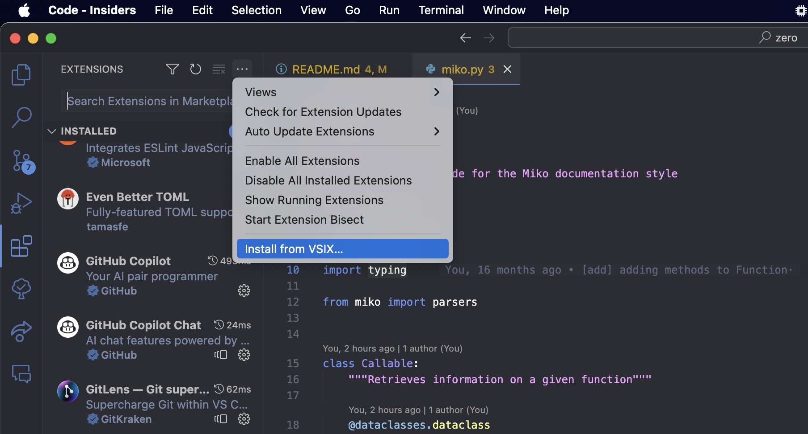

# `miko` (originally: `zero`)


 A new Python documentation style

***See how to use a Python object at a glance!***

<br>
<br>

[](https://pypi.org/project/miko/)
[](https://pepy.tech/project/miko)
[](https://pypistats.org/packages/miko)
[](https://pypi.org/project/miko/)
[](https://pypi.org/project/miko/)
[](https://github.com/Animenosekai/miko/blob/master/LICENSE)
[](https://github.com/Animenosekai/miko)
[](https://github.com/Animenosekai/miko/actions?query=workflow%3ACodeQL)
<!-- [](https://github.com/Animenosekai/miko/actions/workflows/pytest.yml) -->


## Getting Started

These instructions will get you a copy of the project up and running on your local machine for development and testing purposes. See deployment for notes on how to deploy the project on a live system.

### Prerequisites

#### Python

You will need Python 3 to use this module

```bash
# vermin output
Minimum required versions: 3.8
Incompatible versions:     2
```

## Installing

### Option 1: From PyPI

```bash
pip install --upgrade miko
```

### Option 2: From Git

```bash
pip install --upgrade git+https://github.com/Animenosekai/miko
```

You can check if you successfully installed it by printing out its version:

```bash
$ miko --version
# output:
2.0
```

```bash
$ python -c "import miko; print(miko.__version__)"
# output:
2.0
```

## Purpose

This new style aims at bringing an ease of use for both humans and computers.

It also helps me get concise while writing docstrings as I tend to use different styles even within a same file.

## Style

Miko defines a new way of documenting your source code.

You will here learn the different sections of your documentation string.

### Outline

The *Miko* way of documenting stuff is by using Markdown in your docstrings and following the rules below.

#### Start

When documenting a callable, you need to start the docstring right after the callable definition.

> Example 1: *Documenting a callable*

```python
def test(a: int, b: int, /, c: int = 4, d=5, e: int = 6, *args, f: str, **kwargs) -> int:
    """
    Documenting a function

    Parameters
    ----------
    a: int, deprecated
        Hey

    Returns
    -------
    int
    """

    def inner():
        """
        Documenting an inner function

        Note: This is a cool function
        """

class Test:
    """Documenting a class"""

    def __init__(self) -> None:
        """Documenting a method"""
```

> Example 2: *Documenting a variable or constant*

When documenting any other variable, you need to add a string right **after** the variable definition.

```python
CONSTANT = 1
'Documenting a constant'

b: int
"""! DEPRECATED"""
```

Keep in mind that you need to keep the indentation level of the docstring the same as the definition.

```python
def func():
    """
    It needs to start here

    Here we continue the documentation string
^^^^
(do not use this space)
    """
    pass
```

### Description

After starting the documentation string, you can add a description for your object as a normal string.

There is not much styling or rules to follow since all the content outside any section is considered part of the description.

> Example: We are giving a description of the function at the start, but also at the end.

```python
def func():
    """
    Hello, this is a description.

    Returns
    -------
    bool
        The result of the function.

    But this is also part of the description.
    """
```

### Sections

There are 3 types of docstring sections to be aware of:

1. [Map Sections](#map-sections)
2. [Inline Sections](#inline-sections)
3. [Flag Sections](#flag-sections)

#### Map Sections

> **Note**  
> Sometimes also called *Block Sections*

These are sections which contains a list of named elements :

```python
def func():
    """
    Paragraph
    ---------
    element1: options1, options2
        element1 description
    element2: options1, options2
        element2 description
    """
```

Each element has its name, followed by its options and a description.

Here are the built-in sections you can use:

##### Parameters

You can define what are the different parameters/arguments the callable object is taking.

To start explaining the different parameters, you need to use the `Parameters` section name, followed by a line-break and at least 3 hyphens.

The parameters can be inferred from a callable signature if provided.

> Example

```python
def func(a, b: int, c = ""):
    """
    Parameters
    ----------
    a: bool
        this is the first argument
    b: int | float, default = 1.2
        this is the second argument
    c: str, optional
        this is the third argument
        it can have multiple lines
    """
```

> Aliases: `Parameters`, `Parameter`, `Params`, `Parm`, `Arguments`, `Argument`, `Args`, `Arg`

##### Options

You can specify options for each parameter.

The options are separated from the parameter name using a colon and a space.

Each option is separated by a comma.

- `<type>` — Defines the type of the parameter.
- `optional` — Defines a parameter as being optional, without needing to specify its default value. *(useful with keyword arguments for instance)*
- `default` — Defines a parameter as being optional, by giving it a default value.
- `deprecated` — When a parameter is deprecated.

***Types***

Types can be defined by giving the element class name or *dot notation* path.

> Example: `str`, `translatepy.language.Language`

You can specify multiple types using the vertical bar separator.

> Example: `int | float`

***Default***

You can define a default value using an equal sign.

> Example: `default = 1`, `default=True`

##### Returned Value

You can define what are the values returned by a callable object using the `Returns` section.

Each returning element is explained with the following rules: the type of the value and a description with a left-padding on a new line.

The return value can be inferred from a callable signature if provided.

> Example

```python
def func():
    """
    Returns
    -------
    int
        the number returned
    str
        if it is a string returned
    list[int, str]
        if it's a list of both
    translatepy.Language
        using dot notation
    """
```

> Aliases: `Returns`, `Return`, `Returning`

##### Exceptions

You can inform the users about any exception/error your callable might be raising using the `Raising` section.

Like the `Returns` section, you need to give the name of the exception and then a description of why it would raise this exception and the special attribute the exception might have on a new line, left-padded.

> Example

```python
def func():
    """
    Raises
    ------
    ValueError
        If there is an error with the value
    """
```

> Aliases: `Raises`, `Raise`, `Raising`, `Exceptions`, `Exception`, `Errors`, `Error`

##### Changelog

You can inform the users about how the object got modified over time using the `Changelog` section.

Like the `Returns` section, you need to give the name of the version it got changed on and then a description of how it changed on a new line, left-padded.

> Example

```python
def func():
    """
    Changelog
    ---------
    2.0
        Became deprecated, use `new_func` instead
    1.4
        New default string
    0.6
        Raises ImportError instead of RuntimeError
    """
```

> Aliases: `Changelog`, `Changes`

##### Copyright

You can add copyright/authors of the code using the `Copyright` section.

Like the `Returns` section, you need to give the name of the author and then a description of what they did on a new line, left-padded. The description could include stuff like the year they worked on the code, what they did, etc.

Each element in the options here is the license used to distribute the code.

> Example

```python
def func():
    """
    Copyright
    ---------
    Animenosekai: MIT License, from = 2021, to = 2023
        The initial author
    Some other dev: year = 2023
        A very cool collaborator
    """
```

##### Options

You can specify options for each author.

Each option is separated by a comma.

- `<license>` — Defines the license for the code.
- `year` — The year the author worked on the code.
- `from` — The year the author started working on the code.
- `to` — The year the author stopped working on the code.

> Aliases: `Copyrights`, `Copyright`, `Authors`, `Author`

#### Inline Sections

Inline sections can be used inline when there
is no need to have more than a line to describe the section.

If it requires multiple lines, you can use a syntax similar to the
map parser one, and start the section with at least 3 hyphens
and add the lines.

```python
def func():
    """
    This is a function

    Inline: This is an inline section

    Inline
    ------
    This is a multi line inline section
    Wow I can write multiple lines here
    """
```

Here are the built-in inline sections you can use:

##### Example

It is recommended that you give examples on how to use your object.

You can use the `Example` tag to give an example of how to use your object.

```python
def func(a: typing.Union[bool, typing.Any] = False):
    """
    Example
    -------
    >>> func()
    "That's wrong"
    >>> func(True)
    "That's right"
    # when using something other than a boolean
    >>> func(1)
    1 # gives it right back

    Example: Another example

    Note: This function wouldn't really make sense
    """
```

> Aliases: `Examples`, `Example`

##### Notes

If you want to notify the user about something, you can use the `Note` tag.

> Example

```python
def func():
    """
    Note: Yup, that's right

    ...description...

    Note: Another note

    Note
    ----
    Wow this is a
    really long note
    """
```

> Aliases: `Notes`, `Note`, `See Also`, `Information`

##### Warnings

You can give warnings to the user using the `Warning` tag.

> Example

```python
def func():
    """
    Warning: This is a serious warning

    ...description...

    Warning: Another warning
    """
```

> Aliases: `Warnings`, `Warning`

##### Important

You can give important notes to the user using the `Important` tag.

> Example

```python
def func():
    """
    Important: Remember to close the fridge before leaving
    """
```

> Aliases: `Important`, `Important Notice`

#### Flag Sections

A flag is what describes a boolean value in a docstring

If the flag is present, it will be set to True, otherwise it will be set to False

```python
def func():
    """
    This is a function

    ! FLAG

    ! YOU'RE COOL

    (description)
    """
```

> **Note**  
> You can customize the prefix used to recognize a flag using the `flag_prefix` parameter when creating the `Documentation` object.

Here are the built-in flag sections you can use:

##### Deprecation Notice

To add a deprecation notice to your object, you can add `! DEPRECATED` in the docstring.

> Example: At the very beginning of the docstring

```python
def func():
    """! DEPRECATED
    This is a cool function.

    Changelog
    ---------
    1.5
        Added a deprecation notice, with the intention of the function being removed on the next major version.
    """
```

> Example: With a slight variation

```python
def func():
    """
    !DEPRECATED

    This is a cool function.
    """
```

> Aliases: `Deprecated`, `Deprecation`, `Deprecate`, `Deprecation Notice`

## Usage

### Python API

Here are the two main classes exposed by the Python API:

#### The `Documentation` object

This object is the core implementation of the docstring parser.

> Example

```python
from miko import Documentation

parsed = Documentation(
    """
    Hello

    Note: This is a test

    Changelog
    ---------
    1.0
        Adding this docstring
    """
)
```

##### Attributes

- The `original` attribute contains the original docstring.
- The `description` attribute contains the description of the object.

All the other attributes are the different sections of the docstring.

##### Properties

- The `exported` property renders a dictionary with the different elements of the docstring.

##### Extending

You can also easily extend and customize the docstring parser by subclassing the different elements :

```python
from miko import Documentation, parsers

class MyCoolParser(parsers.map.MapParser):
    names = ["New Section", "New Sections"]

class MyCoolDocumentation(Documentation):
    new_section: MyCoolParser

parsed = MyCoolDocumentation(
    """
    New Section
    -----------
    This is a new section
    """
)
# You can now use `parsed.new_section`
```

##### Methods

- **`Documentation.dumps`**

The `dumps` method, which might look familiar to common serialization libraries, lets you dump the documentation string to the cleanest format possible, using all the information the current `Documentation` has.

The optional `indent` parameter (which defaults to 4), lets you choose the indentation level of the output.

It returns a string with the output documentation string.

#### The `Callable` object

This object gathers information on the given callable and its docstring.

It automatically passes its `inspect.Signature` for the parsers to have a better understanding of the object.

It also exposes several attributes and methods to get information on the callable.

#### `miko.static`

This module provides different tools to statically analyze Python code and get information on it.

#### `miko.markdown`

This module provides different tools to render Markdown documentations out of different elements.

### Using the CLI

`Miko` also has a CLI, which you can use to get information about a docstring or clean a docstring.

```swift
🧃❯ miko --help
usage: miko [-h] [--version] {info,clean,docs,overview} ...

See how to use a Python object at a glance!

positional arguments:
  {info,clean,docs,overview}
                        Actions
    info                Gathers information on the different elements in the input
    clean               Cleans the given input
    docs                Generate the documentation for the files loaded by the entry file
    overview            Provides documentation for the given module

options:
  -h, --help            show this help message and exit
  --version, -v         show program's version number and exit
```

Both `info` and `clean` have the same arguments :

```swift
usage: miko <action> [-h] [--indent INDENT] [--noself] [--flag-prefix FLAG_PREFIX] [--safe] [--output OUTPUT] [--raw] input

positional arguments:
  input                 The snippet of code or file to get the docstrings from.

options:
  -h, --help            show this help message and exit
  --indent INDENT, -i INDENT
                        The indentation level for the result
  --noself              Ignoring the "self" parameter from signatures. (useful for class methods)
  --flag-prefix FLAG_PREFIX
                        The prefix for the docstring flags. (default: "!")
  --safe                If the annotations and exceptions should be loaded safely (without loading the modules) (default: False)
  --output OUTPUT, -o OUTPUT
                        The file to output the result to. If not provided, `miko` will use STDOUT.
  --raw                 If the input should be treated as a docstring and not source code. (default: False)
```

#### `info`

The `miko info` command provides information on the different elements in the input.

It statically analyzes the source code, gathers information on all elements (classes, functions, modules, variables, etc.), parses their docstrings and outputs a JSON encoded output with all the information.

> **Note**  
> The `info` command also has the `--minify` flag which lets you minify the output JSON.

If the `--raw` flag is provided, the input will be treated as only being the docstring and not source code, thus only parsing it as a docstring.

> **Warning**  
> Beware that the output structure is different using `--raw`

#### `clean`

The `miko clean` command cleans the given input.

It cleans the different docstrings, formats the code using `autopep8` and sorts the imports using `isort`.

If the `--raw` flag is provided, the input will be treated as only being the docstring and not source code, thus only cleaning it.

#### `docs`

`docs` lets you generate markdown documentation for the given entry file.

It will recursively look for all files imported and generate the documentation for them.

```swift
usage: miko docs [-h] [--output OUTPUT] [--ignore [IGNORE ...]] [--include-private] [--safe] entry

positional arguments:
  entry                 The entry file to document. An entry file could be for example the __init__.py of a library.

options:
  -h, --help            show this help message and exit
  --output OUTPUT, -o OUTPUT
                        The directory to output the result to. If not provided, `miko` will use "./docs"
  --ignore [IGNORE ...]
                        The files to ignore when generating the documentation
  --include-private     If the private objects should be included in the documentation
  --safe                If the annotations and exceptions should be loaded safely (without loading the modules) (default: False)
```

#### `overview`

Overview is similar to `docs` but only produces Markdown documentation for a single file.

```swift
usage: miko overview [-h] [--output OUTPUT] [--include-private] [--safe] module

positional arguments:
  module                The module to provide documentation for

options:
  -h, --help            show this help message and exit
  --output OUTPUT, -o OUTPUT
                        The file to output the result to. If not provided, `miko` will use STDOUT
  --include-private     If the private objects should be included in the documentation
  --safe                If the annotations and exceptions should be loaded safely (without loading the modules) (default: False)
```

### Using the VS Code Extension

You can also use the `Miko` extension for Visual Studio Code.

It lets you format your files instantly using the command palette.


You can configure the arguments passed to `miko` in the VS Code settings (UI or JSON).

#### Installing the extension

Go to [https://marketplace.visualstudio.com/items?itemName=Animenosekai.miko-docs](https://marketplace.visualstudio.com/items?itemName=Animenosekai.miko-docs) to download the published version from the marketplace.

You can also use the `.vsix` file to install the extension.

Head to the [extension folder](./formatter/vscode) and download the [`.vsix`](./formatter/vscode/miko-docs-2.0.0.vsix) file.

Then, go to the *Extensions* section in VS Code, click on the three dots and select *Install from VSIX...*



## Deployment

This module is currently in development and might contain bugs.

Feel free to use it in production if you feel like it is suitable for your production even if you may encounter issues.

## Contributing

Pull requests are welcome. For major changes, please open a discussion first to discuss what you would like to change.

Please make sure to update the tests as appropriate.

## Authors

- **Anime no Sekai** - *Initial work* - [Animenosekai](https://github.com/Animenosekai)

## License

This project is licensed under the MIT License — see the [LICENSE](LICENSE) file for details.
